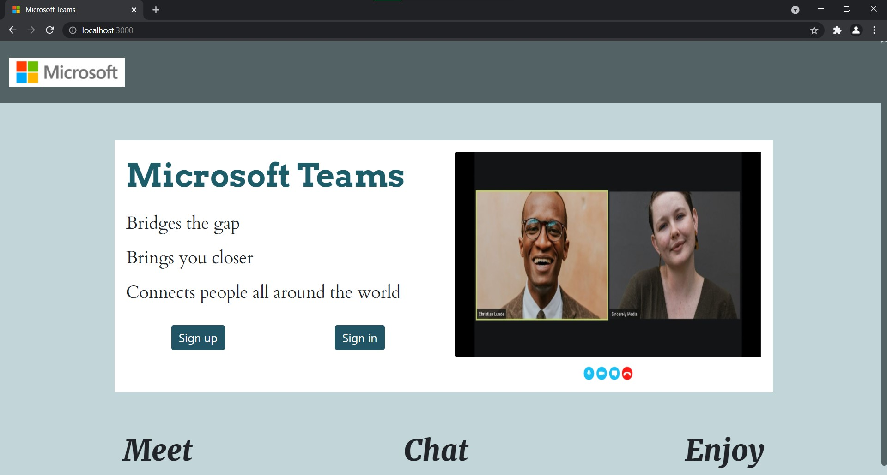

# Microsoft Teams Clone



## Folder Structure

- *UI* : Front-end part of webapp
- *Server* : Back-end part of webapp


## Installation
1. Clone the repository
2. Change the directory to UI
3. Install the dependencies
```
npm install
```

4. Start the server
```
npm start
```


## Start the Backed Server

1. Change the directory to Server 

2. Install the packages
```
npm install
```

3. Enter the dev command
```
npm run dev
```
